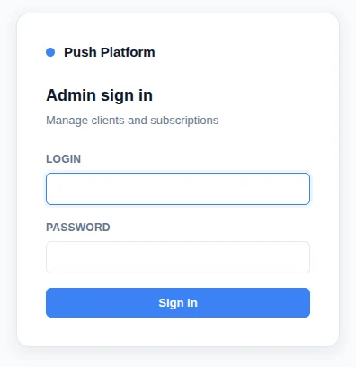
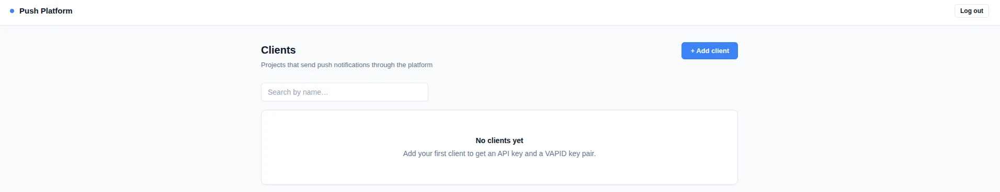
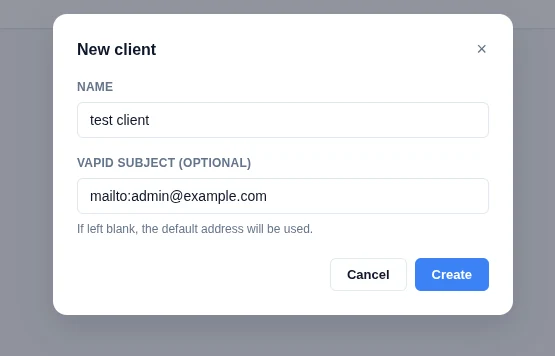
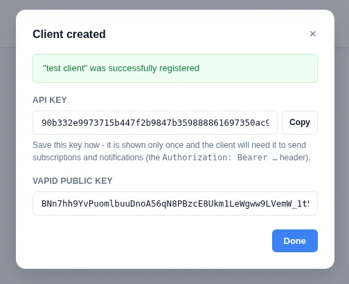
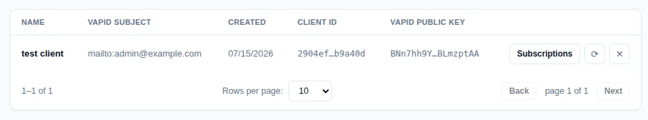
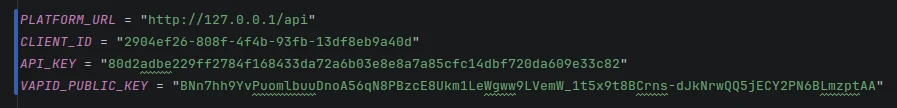
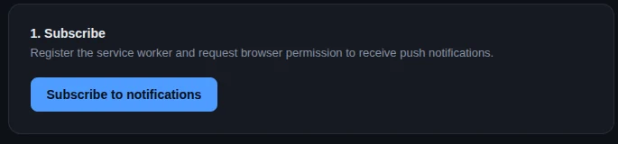
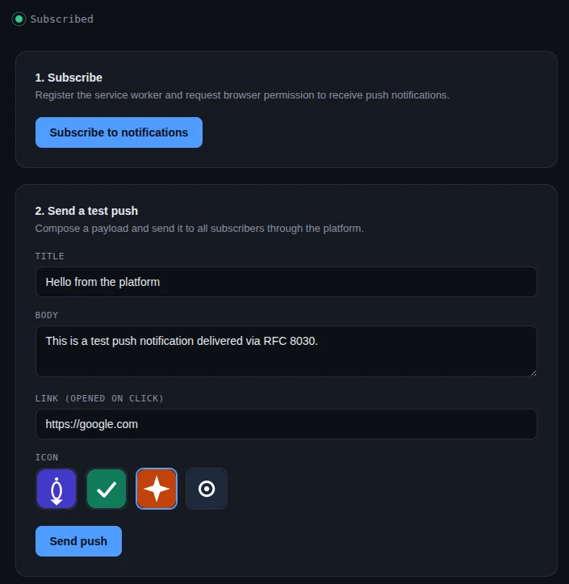
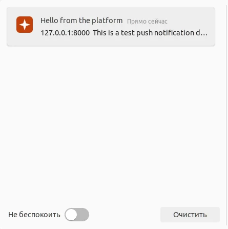

# Web Push Platform

A self-hosted **Web Push (RFC 8030)** notification platform, run as a standalone microservice. It lets you register clients (projects), issue them API keys and public VAPID keys, collect browser push subscriptions, and send push notifications - without depending on any third-party push provider.

- **Backend:** Rust
- **Frontend:** React
- **Storage:** PostgreSQL

---

## Requirements

- Docker & Docker Compose
- A PostgreSQL instance reachable from the containers (locally or elsewhere).
  If you don't have one running locally, you can add a `postgres` service to the compose file.

No build step is required - images are published on Docker Hub and are pulled automatically by `docker compose`.

---

## Quick start

### 1. Configure the environment

The compose file and an example env file live in `docker/`:

```
docker/docker-compose.yaml
docker/.env.example
```

Copy the example file and fill in your values (database connection, admin credentials, etc.):

```bash
cd docker
cp .env.example .env
```

### 2. Start the platform

```bash
docker compose up
```

### 3. Log in

Open the platform in your browser and sign in with the admin credentials you set in `.env`.



### 4. Create a client

Right after login the client list is empty:



Click **+ Add client**, give it a name and (optionally) a VAPID subject:



### 5. Save the generated credentials

On creation the platform generates an **API key** and a **VAPID public key** for the client. The API key is shown **only once** - copy it now, you'll need it to authenticate the client's requests (`Authorization: Bearer <API_KEY>`).



The client now shows up in the list. Clicking on the **Client ID** column copies it to the clipboard:



You now have everything a client needs to talk to the platform:

- `PLATFORM_URL`
- `CLIENT_ID`
- `API_KEY`
- `VAPID_PUBLIC_KEY`

---

## Trying it out with the example client

`examples/server.py` is a minimal, **dependency-free** demo app that shows how to integrate with the platform end-to-end: subscribing a browser to push notifications and sending a test push through the API. It only needs a plain Python 3 interpreter - nothing to install.

### 1. Fill in the constants

Open `examples/server.py` and fill in the values you saved in the previous step:



### 2. Run it

```bash
cd examples
python3 server.py
```

### 3. Subscribe

Open the demo page in your browser, click **Subscribe to notifications**, and allow the browser's permission prompt for push notifications. This registers the service worker and creates a push subscription on the platform.



### 4. Send a test push

Once subscribed, fill in a title, body, link, and icon, then hit **Send push**. The platform delivers it to all current subscribers.



### 5. Receive it

The browser shows the incoming notification:



---

## Summary

1. `cp docker/.env.example docker/.env` and fill it in.
2. `docker compose -f docker/docker-compose.yaml up`
3. Log in with the admin credentials from `.env`.
4. Create a client, save its `CLIENT_ID`, `API_KEY`, and `VAPID_PUBLIC_KEY`.
5. Point `examples/server.py` at those values and run `python3 server.py` to see subscribing and push delivery in action.
